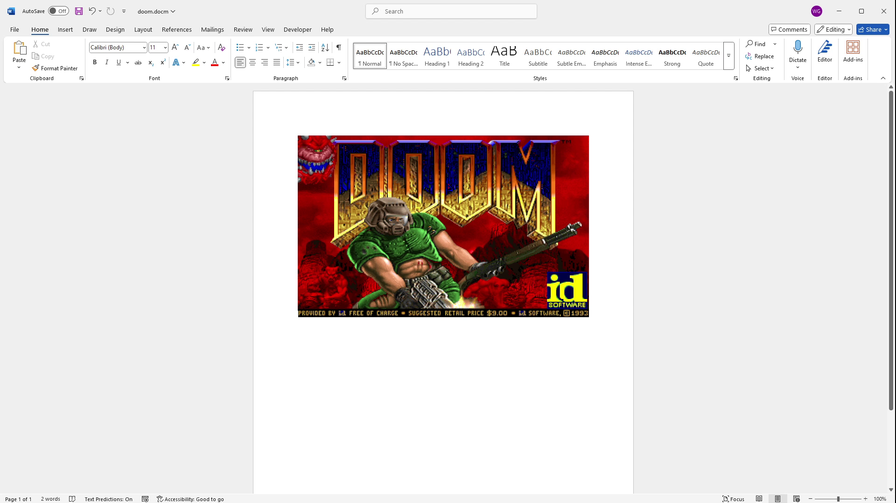

# DooM-docm



**DOOM in Microsoft Word!**

Source-port of [doomgeneric](https://github.com/ozkl/doomgeneric). Does not have sound. Requires an x64 CPU architecture.

See a video of it [here](https://youtu.be/G3XoOCMnSNg)!

## Usage

Download the document from the latest github release, open it, and double-click the run button.

## Build
Requires Make and a MinGW compiler. Creates `bin/doomgeneric_docm.dll`
```
cd doomgeneric
make
```

`bin/doomgeneric_docm.dll` and `doom1.wad` can be converted into VBA macros using `util/codegen.py`.

## Controls

|Action         |Default Keybind|
|---------------|---------------|
|UP             |ARROW UP		|
|DOWN			|ARROW DOWN		|
|LEFT			|ARROW LEFT		|
|RIGHT			|ARROW RIGHT	|
|FIRE			|SPACE			|
|USE			|CTRL           |
|WEAPON SELECT  |1-7            |
